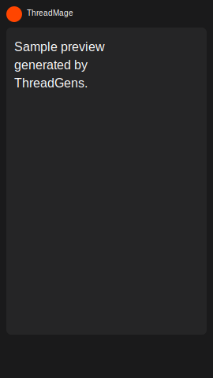

# ThreadGens

ThreadGens is a Java tool that reads lines from a text file and creates one vertical 1080x1920 PNG image per line.

The default layout is built for 9:16 short-form video frames. It keeps the card centered with top and bottom safe space so the output fits TikTok, YouTube Shorts, and Reels-style compositions better.



## Windows one-click setup

On Windows, double-click:

```text
setup_windows.bat
```

The setup script will:

- check/install Java JDK 21 with `winget`
- check/install Ollama with `winget`
- start Ollama and pull `llama3.1:8b`
- download Piper TTS for Windows
- download the `en_US-lessac-medium` Piper voice
- build ThreadGens into `out/`

After setup finishes, double-click:

```text
run_ai_windows.bat
```

That runner asks for a topic and count, then generates:

```text
output/script/generated_comments.txt
output/*.png
output/audio/*.wav
```

## Build manually

```bash
javac -d out src/redditTxtToImg/*.java
```

Or with Gradle:

```bash
gradle build
```

## Run existing text file

```bash
java -cp out redditTxtToImg.RedditScreenshotGenerator data/comments.txt output
```

## GUI

```bash
java -cp out redditTxtToImg.GuiApp
```

The GUI lets you choose an input text file, choose an output folder, and generate images.

## CLI options

```bash
java -cp out redditTxtToImg.RedditScreenshotGenerator data/comments.txt output --count 3 --prefix sample --style light --shuffle --center
```

Options:

- `--count N` limits how many images are generated.
- `--prefix NAME` changes output file names.
- `--style dark|light` chooses a template from `templates/`.
- `--shuffle` shuffles input lines before rendering.
- `--center` centers comments in the vertical card.
- `--top` keeps comments closer to the top of the card.
- `--no-watermark` hides the small watermark.

## Local AI automation

ThreadGens can generate the text locally with Ollama, render the PNGs, and optionally generate matching local TTS audio with Piper.

### Generate text with Ollama, then render images

Make sure Ollama is running locally and the model is already pulled.

```bash
ollama pull llama3.1:8b
java -cp out redditTxtToImg.RedditScreenshotGenerator --auto --topic "weird workplace stories" --count 10 --llm-model llama3.1:8b
```

This writes generated text to:

```text
output/script/generated_comments.txt
```

Then it renders PNGs to:

```text
output/
```

### Generate text, images, and Piper voice audio

Install Piper and download a Piper `.onnx` voice model first, or run `setup_windows.bat`.

```bash
java -cp out redditTxtToImg.RedditScreenshotGenerator --auto \
  --topic "creepy small town stories" \
  --count 10 \
  --llm-model llama3.1:8b \
  --tts piper \
  --voice voices/en_US-lessac-medium.onnx
```

This writes WAV files to:

```text
output/audio/
```

### Local AI options

- `--auto` asks the local LLM to generate a fresh script before rendering.
- `--topic TEXT` controls what the LLM writes about.
- `--llm-model MODEL` sets the Ollama model name. Default: `llama3.1:8b`.
- `--llm-url URL` sets the Ollama generate endpoint. Default: `http://localhost:11434/api/generate`.
- `--script-out FILE` changes where generated text is saved.
- `--tts none|piper` enables or disables voice generation. Default: `none`.
- `--voice FILE` points to a Piper `.onnx` voice model.
- `--tts-command CMD` changes the Piper executable path. Default: `piper`.
- `--audio-dir DIR` changes where WAV files are saved.
- `--tts-timeout SECONDS` changes the per-line TTS timeout.

## Files

- `src/redditTxtToImg/` contains the Java source.
- `data/author_names.txt` contains sample names.
- `data/comments.txt` contains sample input lines.
- `defaults.txt` contains default render and local AI settings.
- `templates/` contains simple color templates.
- `assets/` contains optional images.
- `setup_windows.bat` launches the Windows setup script.
- `setup_windows.ps1` performs the Windows setup work.
- `run_ai_windows.bat` runs the local AI generation pipeline.

Generated images are written to the output folder. Generated scripts and audio are written under `output/` by default.

## Runnable jar

```bash
gradle jar
java -jar build/libs/ThreadGens-1.0.0.jar data/comments.txt output
```

Runnable jar with local AI:

```bash
java -jar build/libs/ThreadGens-1.0.0.jar --auto --topic "strange customer stories" --count 10 --tts piper --voice voices/en_US-lessac-medium.onnx
```
