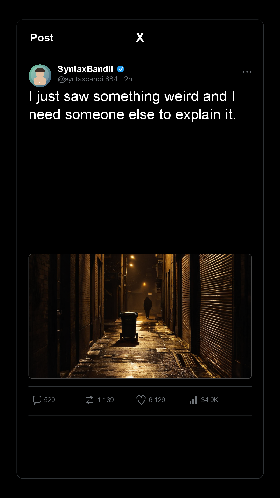
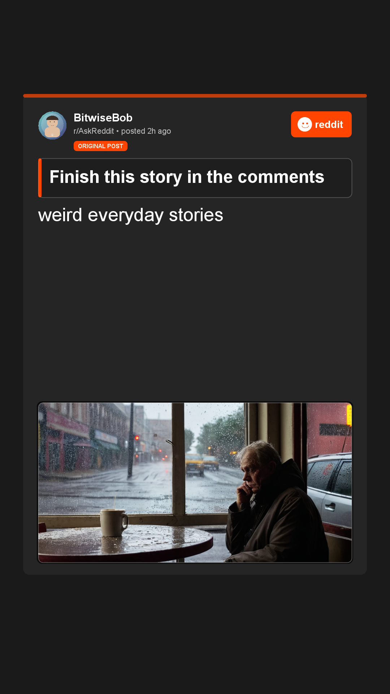

# ThreadGens

ThreadGens is a local Java pipeline for turning Reddit-style threads or X-style posts/replies into 9:16 short-form video assets.

The production pipeline now includes the P0 content-originality work:

- local Ollama script generation,
- deterministic and semantic cross-video novelty checks,
- five meaningfully different content/video formats,
- source-clean fictional social rendering with no fabricated engagement or verification,
- local Kokoro or Piper TTS,
- optional ComfyUI / RealVisXL OP images,
- timed visual-state changes during narration,
- format-specific motion and transitions,
- H.264/AAC FFmpeg output,
- persistent generation history.

The layouts are intended for vertical short-form output such as Shorts, Reels, and TikTok-style videos.

## Example output

X output with OP image:



Reddit output with OP image:



## Windows one-click setup

Double-click:

```text
setup_windows.bat
```

Setup checks/installs the required local stack and builds ThreadGens. In particular it pulls both Ollama models used by the production pipeline:

```text
llama3.1:8b
nomic-embed-text
```

It also sets up Java 21, Kokoro, Piper and the default Piper voice.

Then run:

```text
run_ai_windows.bat
```

The interactive runner asks for platform, prompt content, P0 format, TTS engine/voice, optional OP image generation, and whether to create the final video.

For Reddit:

```text
post title
post body
```

For X:

```text
optional hidden reply style
visible original X post text
```

The normal and batch Windows runners keep Ollama loaded between generations by default.

Default outputs:

```text
output/script/generated_comments.txt
output/*.png
output/images/*.png
output/cache/images/*.txt
output/audio/*.wav
output/video/*.mp4
output/video/final.mp4
```

## Build manually

```bash
javac -d out src/redditTxtToImg/*.java
```

Or:

```bash
gradle build
```

## Production CLI entrypoint

`CheckedRunner` is the recommended compatibility-friendly CLI entrypoint:

```bash
java -cp out redditTxtToImg.CheckedRunner data/comments.txt output --platform reddit
```

`CheckedRunner` now routes normal work through `P0Entrypoint`, so existing scripts automatically receive the P0 originality, integrity, format and dynamic-video behavior.

You can also invoke the production entrypoint directly:

```bash
java -cp out redditTxtToImg.P0Entrypoint data/comments.txt output --platform reddit
```

`OpImageVideoSafeRunner` is retained as a backward-compatible alias for the same P0 production path:

```bash
java -cp out redditTxtToImg.OpImageVideoSafeRunner --platform x --auto \
  --topic "I just saw something weird and I need someone else to explain it." \
  --count 10 \
  --tts kokoro \
  --tts-command .venv-kokoro/Scripts/python.exe \
  --voice af_heart \
  --video --concat-video
```

Supported platforms:

- `reddit`
- `x`
- `twitter` as an alias for `x`

### Explicit raw/debug path

If you intentionally need the low-level checked renderer without P0 format/novelty/timed-video orchestration, use:

```bash
java -cp out redditTxtToImg.RawCheckedRunner data/comments.txt output --platform reddit
```

Direct renderer classes also remain available for development/debugging:

```bash
java -cp out redditTxtToImg.RedditScreenshotGenerator data/comments.txt output
java -cp out redditTxtToImg.XThreadGenerator data/comments.txt output
```

Even raw renderer output no longer fabricates engagement counts or X verification because that integrity rule is enforced at the renderer source.

## GUI

```bash
java -cp out redditTxtToImg.GuiApp
```

The GUI calls `CheckedRunner`, which now means GUI generation also uses the P0 production path.

## Local AI generation

Make sure Ollama is running. Normal Windows setup already pulls the required models; for a manual setup:

```bash
ollama pull llama3.1:8b
ollama pull nomic-embed-text
```

Reddit example:

```bash
java -cp out redditTxtToImg.CheckedRunner --platform reddit --auto \
  --post-title "Finish this story in the comments" \
  --topic "I found a locked box behind my dryer." \
  --count 10 \
  --llm-model llama3.1:8b
```

X example:

```bash
java -cp out redditTxtToImg.CheckedRunner --platform x --auto \
  --post-title "Wrong answers only" \
  --topic "Why is there a shopping cart in my living room?" \
  --count 10
```

For X, `--post-title` is a hidden reply-style instruction; `--topic` is the visible original post. If no X style is supplied, ThreadGens does not inherit the Reddit default title.

## P0 content formats

Use `--format auto` for content-aware selection plus recent-format rotation. Explicit formats are:

```text
thread_story
confession
debate
best_answers
escalating_conversation
```

Example:

```bash
java -cp out redditTxtToImg.CheckedRunner --platform reddit --auto \
  --format debate \
  --post-title "Am I wrong here?" \
  --topic "My roommate and I disagree about the lease." \
  --count 8
```

The formats alter generation structure, layout, motion, timed visual focus, pacing and final transitions—not just colors.

## P0 novelty system

Accepted scripts are recorded in:

```text
data/generation_history.jsonl
```

The file is git-ignored.

Auto-generation first runs deterministic checks for exact/near duplicate wording, hooks and structural reuse. It then compares semantic embeddings against recent scripts to catch the same underlying story/joke/conflict after substantial paraphrasing.

Default semantic model:

```text
nomic-embed-text
```

A malformed existing history file fails the auto-generation run instead of silently being treated as empty history.

Useful controls:

- `--history-file PATH`
- `--history-limit N`
- `--novelty-threshold N`
- `--novelty-retries N`
- `--embedding-model MODEL`
- `--semantic-threshold 0.86`
- `--semantic-history-limit N`
- `--no-novelty` for deliberate one-off/debug runs
- `--no-semantic-novelty` to disable the embedding comparison while retaining deterministic novelty and strict history validation

## Social-render integrity

Generated fictional social frames do not invent platform engagement signals:

- no generated Reddit upvote/view counts,
- no generated X reply/repost/like/view counts,
- no generated X verification badge,
- no fixed precise fake X timestamp.

Relative chronology and neutral fictional-thread labels may still be shown to preserve a readable thread layout.

## OP image generation

OP image generation is optional.

Use local ComfyUI:

```bash
--image-mode comfyui
```

Or use an existing local image:

```bash
--image-mode local --op-image path/to/image.png
```

Default ComfyUI endpoint:

```text
http://127.0.0.1:8188
```

Default checkpoint:

```text
RealVisXL_V5.0_fp32.safetensors
```

Example:

```bash
java -cp out redditTxtToImg.CheckedRunner --platform reddit --auto \
  --post-title "Finish this story in the comments" \
  --topic "weird everyday stories" \
  --count 10 \
  --image-mode comfyui \
  --tts kokoro \
  --tts-command .venv-kokoro/Scripts/python.exe \
  --voice af_heart \
  --video --concat-video
```

Important OP-image options:

- `--image-mode none|local|comfyui`
- `--op-image FILE`
- `--image-dir DIR`
- `--image-cache-dir DIR`
- `--comfy-url URL`
- `--image-checkpoint NAME`
- `--image-width N`
- `--image-height N`
- `--image-steps N`
- `--image-cfg N`
- `--image-sampler NAME`
- `--image-scheduler NAME`
- `--image-negative TEXT`
- `--image-timeout SECONDS`

## Local TTS

Supported engines:

- `--tts kokoro`
- `--tts piper`
- `--tts none`

Kokoro example:

```bash
java -cp out redditTxtToImg.CheckedRunner --platform reddit --auto \
  --topic "I found a second phone hidden in my car." \
  --count 10 \
  --tts kokoro \
  --tts-command .venv-kokoro/Scripts/python.exe \
  --voice af_heart
```

Piper example:

```bash
java -cp out redditTxtToImg.CheckedRunner --platform reddit --auto \
  --topic "creepy small town stories" \
  --count 10 \
  --tts piper \
  --voice voices/en_US-lessac-medium.onnx
```

TTS options:

- `--voice NAME_OR_PATH`
- `--voice-dir DIR`
- `--list-voices`
- `--tts-command CMD`
- `--audio-dir DIR`
- `--tts-timeout SECONDS`

## Dynamic video

Video generation requires FFmpeg and FFprobe.

```bash
java -cp out redditTxtToImg.CheckedRunner --platform x --auto \
  --topic "Why is there a shopping cart in my living room?" \
  --count 10 \
  --tts kokoro \
  --tts-command .venv-kokoro/Scripts/python.exe \
  --voice af_heart \
  --video --concat-video
```

P0 video generation does not simply loop one unchanged screenshot. Each narration segment is split into timed visual states based on its actual audio duration, targeting a visible focus/content change roughly every 2.5 seconds for normal narration. Each state still has continuous motion, then the final clips are stitched using a transition profile specific to the selected content format.

Delivery remains conventional H.264/AAC/yuv420p with `+faststart`.

Video options:

- `--video`
- `--concat-video`
- `--video-dir DIR`
- `--video-command CMD`
- `--fps N`
- `--video-timeout SECONDS`
- `--final-video NAME.mp4`

## Batch video creation

Edit:

```text
data/batch_videos.txt
```

Use two non-empty lines per video.

Reddit:

```text
line 1 = post title
line 2 = post body
```

X:

```text
line 1 = hidden reply style
line 2 = visible X post text
```

Then run:

```text
batch_create_videos_windows.bat
```

The batch PowerShell runner accepts:

```text
-Format auto|thread_story|confession|debate|best_answers|escalating_conversation
```

Final copies are collected under:

```text
output/batch_videos/<platform>_<timestamp>/final_videos/
```

## Profile pictures and usernames

Run:

```text
generate_profiles_windows.bat
```

Procedural mode:

```bash
python tools/generate_profiles.py --count 100 --size 256
```

ComfyUI mode:

```bash
python tools/generate_comfy_profiles.py --count 25 --size 512 --comfy-url http://127.0.0.1:8188
```

Generated profiles go to `assets/pfp/`; generated usernames go to `data/author_names.txt`.

## Validation

The repository smoke workflow compiles Java 21 and runs:

- deterministic P0 unit tests,
- strict novelty-history tests,
- visual-cadence tests,
- real FFmpeg/ffprobe timed-video tests for all five formats,
- production Reddit/X rendering tests,
- raw compatibility tests,
- OP-image overlay tests,
- expected-failure tests,
- Windows Java compilation and PowerShell parser validation.

See `P0_IMPLEMENTATION.md` for the detailed architecture and acceptance behavior.

## Important files

- `src/redditTxtToImg/P0Entrypoint.java` — production orchestration entrypoint.
- `src/redditTxtToImg/P0Runner.java` — render/video/history orchestration.
- `src/redditTxtToImg/CheckedRunner.java` — compatibility-friendly production CLI.
- `src/redditTxtToImg/RawCheckedRunner.java` — explicit raw/debug compatibility path.
- `src/redditTxtToImg/FormatAwareTextGenerator.java` — hidden format-aware generation.
- `src/redditTxtToImg/NoveltyGuard.java` — deterministic novelty.
- `src/redditTxtToImg/SemanticNoveltyGuard.java` — Ollama embedding novelty.
- `src/redditTxtToImg/VideoTimeline.java` — duration-based visual timing.
- `src/redditTxtToImg/TimedVisualStateRenderer.java` — per-segment visual states.
- `src/redditTxtToImg/DynamicVisualRenderer.java` — format-specific compositions.
- `src/redditTxtToImg/DynamicVideoGenerator.java` — FFmpeg timed-state rendering and format transitions.
- `src/redditTxtToImg/RedditScreenshotGenerator.java` — source-clean Reddit frame renderer.
- `src/redditTxtToImg/XThreadGenerator.java` — source-clean X frame renderer.
- `defaults.txt` — production defaults.
- `tools/run_ai_windows.ps1` — interactive Windows pipeline.
- `tools/batch_create_videos.ps1` — Windows batch pipeline.

## Runnable JAR

```bash
gradle jar
java -jar build/libs/ThreadGens-0.5.0-p0-originality.jar data/comments.txt output
```

Auto-generation example:

```bash
java -jar build/libs/ThreadGens-0.5.0-p0-originality.jar --platform x --auto \
  --post-title "Wrong answers only" \
  --topic "Why is there a shopping cart in my living room?" \
  --count 10 \
  --tts kokoro --voice af_heart
```
