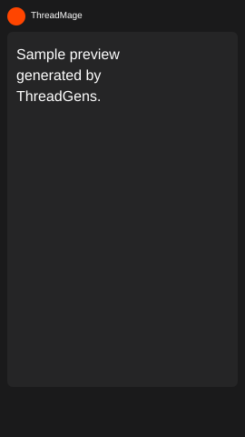

# ThreadGens

ThreadGens is a local Java tool for turning Reddit-style threads or X-style posts/replies into 9:16 short-form video assets.

It can:

- read one text file and create one 1080x1920 PNG frame per line
- generate a fresh Reddit thread locally with Ollama
- generate a fresh X post and replies locally with Ollama
- generate local voice audio with Kokoro or Piper
- render per-frame MP4 clips with FFmpeg
- stitch clips into one final MP4
- generate profile pictures and usernames for fake Reddit/X-style accounts

The default layout is built for TikTok, YouTube Shorts, and Reels-style vertical videos.



## Windows one-click setup

On Windows, double-click:

```text
setup_windows.bat
```

The setup script will:

- check/install Java JDK 21 with `winget`
- check/install Python for Kokoro
- check/install Ollama with `winget`
- start Ollama and pull `llama3.1:8b`
- download Piper TTS for Windows
- download the `en_US-lessac-medium` Piper voice
- create an isolated `.venv-kokoro` environment
- install Kokoro TTS requirements
- build ThreadGens into `out/`
- check profile-generator support

After setup finishes, double-click:

```text
run_ai_windows.bat
```

That runner asks for platform/thread style, TTS engine, prompt text, count, and optional final video output.

For Reddit:

```text
post title
post body
```

For X:

```text
optional hidden reply style
visible original X post text
```

Default outputs:

```text
output/script/generated_comments.txt
output/*.png
output/audio/*.wav
output/video/*.mp4
output/video/final.mp4
```

## Build manually

```bash
javac -d out src/redditTxtToImg/*.java
```

Or with Gradle:

```bash
gradle build
```

## Recommended CLI entrypoint

Use `CheckedRunner` for scripts and normal command-line runs:

```bash
java -cp out redditTxtToImg.CheckedRunner data/comments.txt output
```

`CheckedRunner` delegates to the selected renderer, then verifies that the expected fresh PNG/WAV/MP4 files were actually created. This prevents failed runs from looking successful.

Select a platform with `--platform`:

```bash
java -cp out redditTxtToImg.CheckedRunner data/comments.txt output --platform reddit
java -cp out redditTxtToImg.CheckedRunner data/comments.txt output --platform x
```

Supported values:

- `reddit`
- `x`
- `twitter` as an alias for `x`

The older renderer entrypoints still exist:

```bash
java -cp out redditTxtToImg.RedditScreenshotGenerator data/comments.txt output
java -cp out redditTxtToImg.XThreadGenerator data/comments.txt output
```

Use them only when you want raw renderer behavior without checked artifact validation.

## GUI

```bash
java -cp out redditTxtToImg.GuiApp
```

The GUI lets you choose an input text file, choose an output folder, and generate images. It uses the checked runner so missing output files show as failures instead of false success.

## CLI options

Basic Reddit image generation:

```bash
java -cp out redditTxtToImg.CheckedRunner data/comments.txt output --platform reddit --count 3 --prefix sample --style light --shuffle --center
```

Basic X image generation:

```bash
java -cp out redditTxtToImg.CheckedRunner data/comments.txt output --platform x --count 3 --prefix xsample --top
```

Image options:

- `--platform reddit|x` chooses the screenshot/thread style. Default: `reddit`.
- `--count N` limits how many frames are generated.
- `--prefix NAME` changes output file names. Files are named like `0NAME.png`, `1NAME.png`, etc.
- `--style dark|light` chooses a Reddit template from `templates/`.
- `--shuffle` shuffles input lines before rendering.
- `--center` centers Reddit comments in the vertical card.
- `--top` keeps text closer to the top of the card.
- `--no-watermark` hides the small watermark.
- `--gui` opens the GUI.

## Local AI text generation

Make sure Ollama is running locally and the model is already pulled:

```bash
ollama pull llama3.1:8b
```

Reddit auto-generation:

```bash
java -cp out redditTxtToImg.CheckedRunner --platform reddit --auto --post-title "Finish this story in the comments" --topic "I found a locked box behind my dryer." --count 10 --llm-model llama3.1:8b
```

X auto-generation:

```bash
java -cp out redditTxtToImg.CheckedRunner --platform x --auto --post-title "Wrong answers only" --topic "Why is there a shopping cart in my living room?" --count 10 --llm-model llama3.1:8b
```

For X, `--post-title` is not displayed. It is only a hidden reply style/instruction. The visible X post is `--topic`.

X example with no hidden style:

```bash
java -cp out redditTxtToImg.CheckedRunner --platform x --auto --topic "What the fuck do I do with my life now?" --count 5 --llm-model llama3.1:8b
```

Local AI options:

- `--auto` asks the local LLM to generate a fresh script before rendering.
- `--post-title TEXT` sets the visible Reddit title, or hidden X reply style.
- `--topic TEXT` sets the Reddit post body/story, or visible X post text.
- `--llm-model MODEL` sets the Ollama model name. Default: `llama3.1:8b`.
- `--llm-url URL` sets the Ollama generate endpoint. Default: `http://localhost:11434/api/generate`.
- `--script-out FILE` changes where generated text is saved.
- `--keep-ollama-loaded` skips the default unload request after script generation.

## Local TTS

ThreadGens supports:

- `--tts kokoro` for Kokoro voices such as `af_heart`, `af_bella`, `am_adam`, etc.
- `--tts piper` for Piper `.onnx` voice models.
- `--tts none` to skip audio.

Kokoro Reddit example:

```bash
java -cp out redditTxtToImg.CheckedRunner --platform reddit --auto \
  --post-title "Finish this story in the comments" \
  --topic "I found a second phone hidden in my car." \
  --count 10 \
  --tts kokoro \
  --tts-command .venv-kokoro/Scripts/python.exe \
  --voice af_heart
```

Kokoro X example:

```bash
java -cp out redditTxtToImg.CheckedRunner --platform x --auto \
  --post-title "Wrong answers only" \
  --topic "Why is there a shopping cart in my living room?" \
  --count 10 \
  --tts kokoro \
  --tts-command .venv-kokoro/Scripts/python.exe \
  --voice af_heart
```

Piper example:

```bash
java -cp out redditTxtToImg.CheckedRunner --platform reddit --auto \
  --post-title "Finish this story in the comments" \
  --topic "creepy small town stories" \
  --count 10 \
  --tts piper \
  --voice voices/en_US-lessac-medium.onnx
```

TTS options:

- `--tts none|piper|kokoro` enables or disables voice generation.
- `--voice NAME_OR_PATH` sets the Kokoro voice name or Piper voice path/name.
- `--voice-dir DIR` sets the Piper voice directory.
- `--list-voices` lists local Piper voices and common Kokoro voices.
- `--tts-command CMD` changes the executable used by the selected TTS engine.
- `--audio-dir DIR` changes where WAV files are saved.
- `--tts-timeout SECONDS` changes the per-line TTS timeout.

## Video generation

Video generation requires FFmpeg and FFprobe on PATH, or a direct path passed with `--video-command`.

```bash
java -cp out redditTxtToImg.CheckedRunner --platform x --auto \
  --post-title "Wrong answers only" \
  --topic "Why is there a shopping cart in my living room?" \
  --count 10 \
  --tts kokoro \
  --tts-command .venv-kokoro/Scripts/python.exe \
  --voice af_heart \
  --video \
  --concat-video
```

Video options:

- `--video` renders one MP4 clip per PNG/WAV pair.
- `--concat-video` also stitches those clips into one final MP4.
- `--video-dir DIR` changes where clips and final videos are saved.
- `--video-command CMD` changes the FFmpeg executable path.
- `--fps 30` sets video FPS.
- `--video-timeout SECONDS` changes the FFmpeg timeout.
- `--final-video NAME.mp4` changes the stitched final video name.

## Batch video creation

Create or edit:

```text
data/batch_videos.txt
```

Format uses two non-empty lines per video.

For Reddit:

```text
line 1 = post title
line 2 = post body
line 3 = next post title
line 4 = next post body
```

For X:

```text
line 1 = hidden reply style
line 2 = visible X post text
line 3 = next hidden reply style
line 4 = next visible X post text
```

Then run:

```text
batch_create_videos_windows.bat
```

Batch outputs go under:

```text
output/batch_videos/<platform>_<timestamp>/
```

Final MP4 copies are collected in:

```text
output/batch_videos/<platform>_<timestamp>/final_videos/
```

## Profile pictures and usernames

Run:

```text
generate_profiles_windows.bat
```

Choose either:

1. AI face/selfie profile pictures through local ComfyUI.
2. Fast procedural fallback avatars with no AI model.

Direct procedural mode:

```bash
python tools/generate_profiles.py --count 100 --size 256
```

Direct ComfyUI mode:

```bash
python tools/generate_comfy_profiles.py --count 25 --size 512 --comfy-url http://127.0.0.1:8188
```

Generated profile pictures go to:

```text
assets/pfp/
```

Generated usernames go to:

```text
data/author_names.txt
```

## Files

- `src/redditTxtToImg/` contains the Java source.
- `src/redditTxtToImg/CheckedRunner.java` is the safe CLI/script entrypoint.
- `src/redditTxtToImg/RedditScreenshotGenerator.java` renders Reddit-style frames.
- `src/redditTxtToImg/XThreadGenerator.java` renders X-style frames.
- `src/redditTxtToImg/LocalLlmTextGenerator.java` handles Reddit Ollama generation.
- `src/redditTxtToImg/XLocalLlmTextGenerator.java` handles X Ollama generation.
- `data/author_names.txt` contains sample names.
- `data/comments.txt` contains sample input lines.
- `defaults.txt` contains default render and local pipeline settings.
- `templates/` contains simple Reddit color templates.
- `assets/` contains optional images.
- `tools/kokoro_tts.py` is the Kokoro helper used by Java.
- `tools/generate_profiles.py` creates procedural avatars and usernames.
- `tools/generate_comfy_profiles.py` creates ComfyUI profile images and usernames.
- `tools/batch_create_videos.ps1` powers batch video creation.
- `setup_windows.bat` launches Windows setup.
- `run_ai_windows.bat` runs the normal local AI pipeline.

## Runnable jar

```bash
gradle jar
java -jar build/libs/ThreadGens-0.4.0-x-platform.jar data/comments.txt output
```

Runnable jar with local AI:

```bash
java -jar build/libs/ThreadGens-0.4.0-x-platform.jar --platform x --auto --post-title "Wrong answers only" --topic "Why is there a shopping cart in my living room?" --count 10 --tts kokoro --voice af_heart
```
